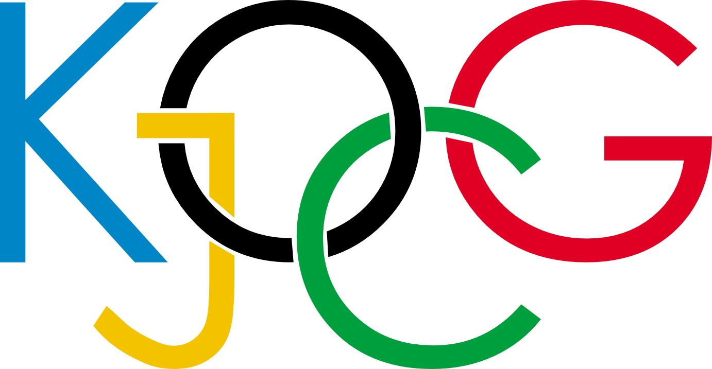
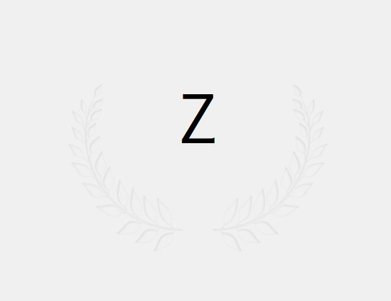
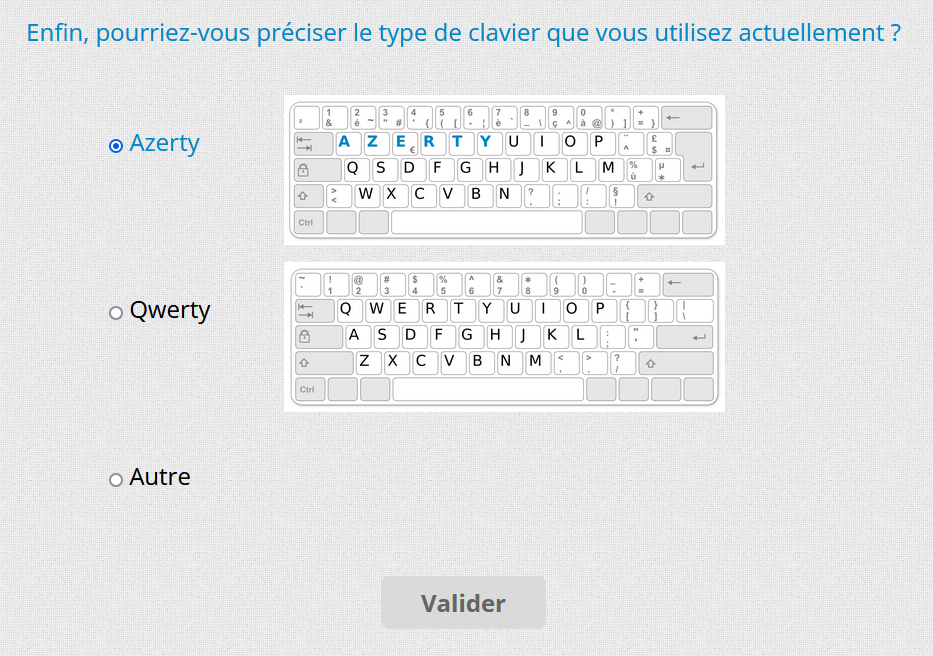

## Online experiment: "Jeux Olympiques du Clavier" / Keyboard Olympic games _(onx\_jockog)_

### 

The game consists to press the key of the keyboard corresponding to the character which is appearing on the screen. The reaction time is collected. 

The study concerns the learning of regularities: certain sequences of 3 letters (regularities) are reproduced several times during the series played, the study aims at evaluating the evolution of the reaction times according to the order of occurence of these regularities.
 
The experiment was built using the [jsPsych library](https://www.jspsych.org), and a customized plugins have been created (./lib/jspsych/plugins/):
* _jspsych-char-typing.js:_ display of one letter by one letter and the participant response (validity and reaction time)
  
* _jspsych-countdown.js:_ display of a countdown with animated numbers at each second ("3..2..1.. go!")
* _jspsych-form-kb-layout.js:_ special form layout to ask the participant for the kind of keyboard that is used (azerty, querty, other)
  
* _jspsych-form.js:_ display of a complexe form with different type of responses (radio button, checkbox, list, input field)

### Research team:
Arnaud Rey1, Benoît Favre2, Christelle Zielinski3 (1[Laboratoire de Psychologie Cognitive](https://lpc.univ-amu.fr/) ; 2[Laboratoire d'Informatique & Systèmes](https://www.lis-lab.fr/) ; 3[Institute of Language, Communication and the Brain](https://www.ilcb.fr/))
